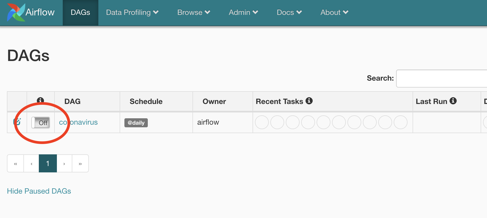
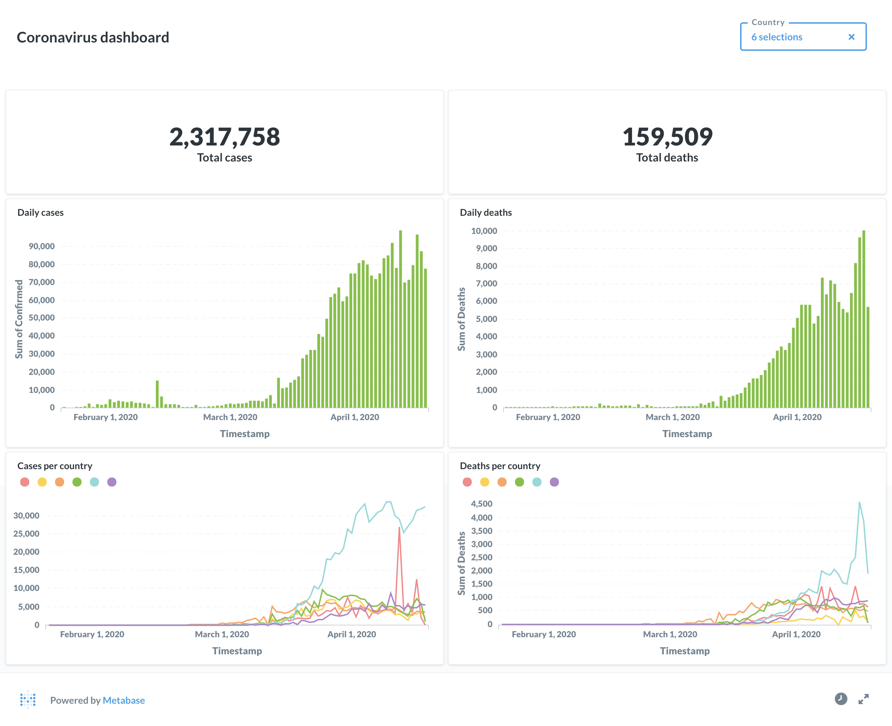

# Coronavirus Dashboard
A simple analytics pipeline for SARS-CoV-2, built with [Airflow](https://github.com/apache/airflow), [Spark](https://github.com/apache/spark), [Druid](https://github.com/apache/druid) and [Metabase](https://github.com/metabase/metabase), powered by Johns Hopkins [dataset](https://github.com/CSSEGISandData/COVID-19).

Live demo: https://coronavirus.nubase.tk

## Usage
First, we need to start all services (this may take a while for the images to build for the first time). Be sure to increase memory available to docker (6GB should be enough).
```shell script
$ docker-compose up
```

Then we can go to Airflow UI at http://localhost:8080 and monitor `coronavirus` DAG:



Once the DAG is complete, we can see our dashboard here http://localhost:



Or go to Metabase at http://localhost:3000 to create and edit new plots with our freshly crunched data:

- Email: `admin@admin.com`
- Password: `qwerty123`

## Troubleshooting 
If Airflow is hanging or you are getting weird log messages from Druid:

```shell script
druid_1     | [Wed Apr 22 13:47:32 2020] Command[broker] exited (pid = 19, signal = 9)
druid_1     | [Wed Apr 22 13:47:32 2020] Command[broker] failed, see logfile for more details: /opt/druid/var/sv/broker.log
druid_1     | [Wed Apr 22 13:47:35 2020] Running command[broker], logging to[/opt/druid/var/sv/broker.log]: bin/run-druid broker conf/druid/single-server/nano-quickstart
```

or other services:

```shell script
coronavirus_metabase_1 exited with code 137
```

then it probably means you don't have enough memory and docker is shutting down processes. Please increase memory available to docker and try again.

## Short description
So what happened here? We just run a small but complete analytics pipeline on our pc, which involves the following steps: 
1. Getting the most recent data from Johns Hopkins dataset,
2. Transforming it to a suitable format using Spark,
3. And ingesting it into Druid, a high performance analytics data store.

All the above steps were coordinated by Airflow, a workflow scheduler. So when we started `coronavirus` DAG, it executed the above steps and it will continue doing so every 3 hours, in order to fetch latest changes to the dataset.

Lastly, we used Metabase, a powerful business intelligence platform, to query our data and create different visualizations.

Enjoy!
