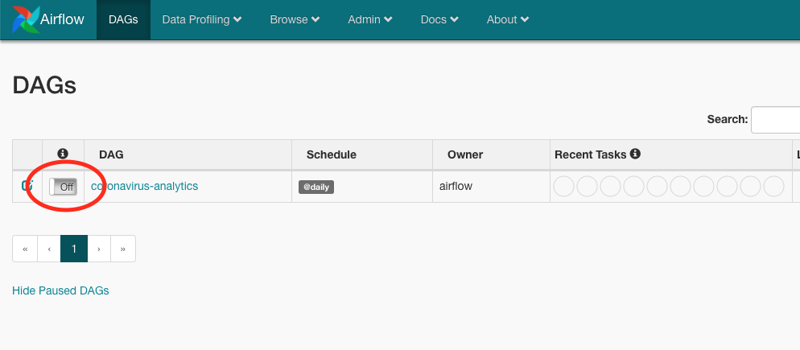
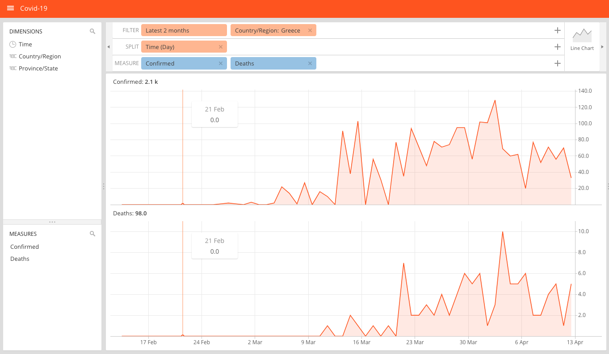

# Coronavirus Dashboard
A simple analytics pipeline for SARS-CoV-2, built with Airflow, Spark, Druid and [Turnilo](https://github.com/allegro/turnilo), powered by Johns Hopkins [dataset](https://github.com/CSSEGISandData/COVID-19).

## Usage
First, we need to start all services (this may take a while for the images to download the first time):
```shell script
$ docker-compose up
```

Then we go to Airflow UI at http://localhost:8080 and switch on `coronavirus-analytics` DAG:



Once the DAG is complete, we can open Turnilo at http://localhost:9090 to view and create plots with our freshly crunched data:



## Overview
So what happened here? We just run a small but complete analytics pipeline on our pc, which involves the following steps: 
1. Getting the most recent data from Johns Hopkins dataset,
2. Transforming it to a suitable format using Spark,
3. And ingesting it into Druid, a high performance analytics data store.

All the above steps were coordinated by Airflow, a workflow scheduler. So when we started `coronavirus-analytics` DAG, it executed the above steps and it will continue doing so everyday, so that we get new data.

Lastly, we used Turnilo, a simple and easy-to-use business intelligence platform, to query our data and create different view (filters, splits, etc.).

Enjoy!
