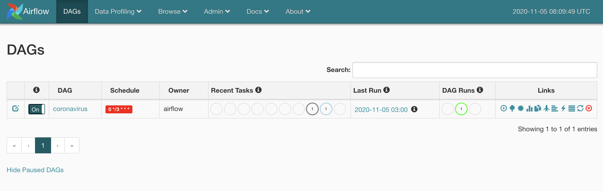

# Coronavirus Dashboard
A simple analytics pipeline for SARS-CoV-2, built with [Airflow](https://github.com/apache/airflow), [Spark](https://github.com/apache/spark), [Druid](https://github.com/apache/druid) and [Turnilo](https://github.com/allegro/turnilo), powered by Johns Hopkins [dataset](https://github.com/CSSEGISandData/COVID-19).

## Usage
First, we need to start all services (this may take a while for the images to download the first time). Be sure to increase memory available to docker (6GB should be enough).
```shell script
$ docker-compose up
```

Then we can go to Airflow UI at http://localhost:8080 and switch on `coronavirus` DAG:



Once the DAG is complete, we can see our dashboard [here](http://localhost:3000/public/dashboard/38b4cca5-8b70-4ba1-a37c-b09115939aa1):


Or go to http://localhost:3000 to create and edit new plots with our freshly crunched data:

- Email: `admin@admin.com`
- Password: `qwerty123`

## Short description
So what happened here? We just run a small but complete analytics pipeline on our pc, which involves the following steps: 
1. Getting the most recent data from Johns Hopkins dataset,
2. Transforming it to a suitable format using Spark,
3. And ingesting it into Druid, a high performance analytics data store.

All the above steps were coordinated by Airflow, a workflow scheduler. So when we started `coronavirus-analytics` DAG, it executed the above steps and it will continue doing so everyday, in order to fetch new data.

Lastly, we used Metabase, a powerful business intelligence platform, to query our data and create different visualizations.

Enjoy!
